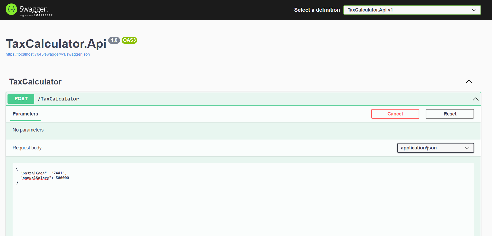

# CalculateTax
Tax Calculator

## Getting Started

These instructions will get you a copy of the project up and running on your local machine for development and testing purposes.

1. Restore SQL Db located in the database folder. 
2. Change connection string in the Apsettings.json file to point to your restored DB
3. You can then Run the Application "TaxCalculator.Api"

Please note this repository only contains the backend logic for TaxCalculator Web Api 

### Prerequisites

List the software and tools that need to be installed on your machine. For example:

- [.NET Core](https://dotnet.microsoft.com/download) - .Net Core 6
- [SQL Server](https://www.microsoft.com/en-us/sql-server/sql-server-downloads)

